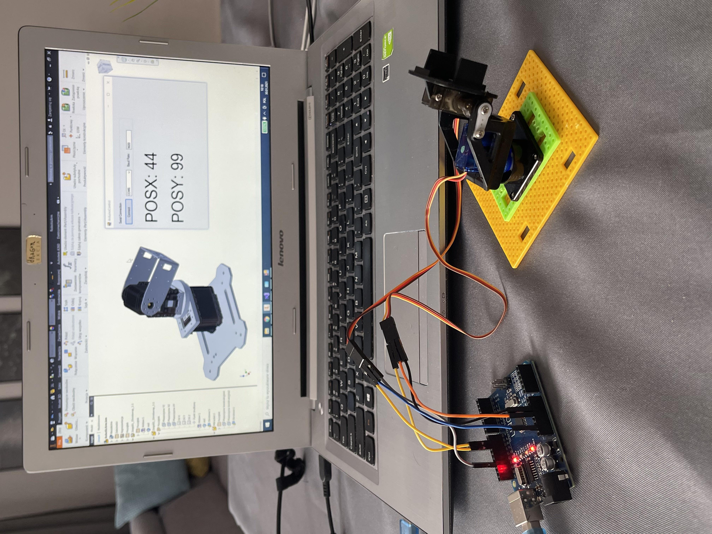
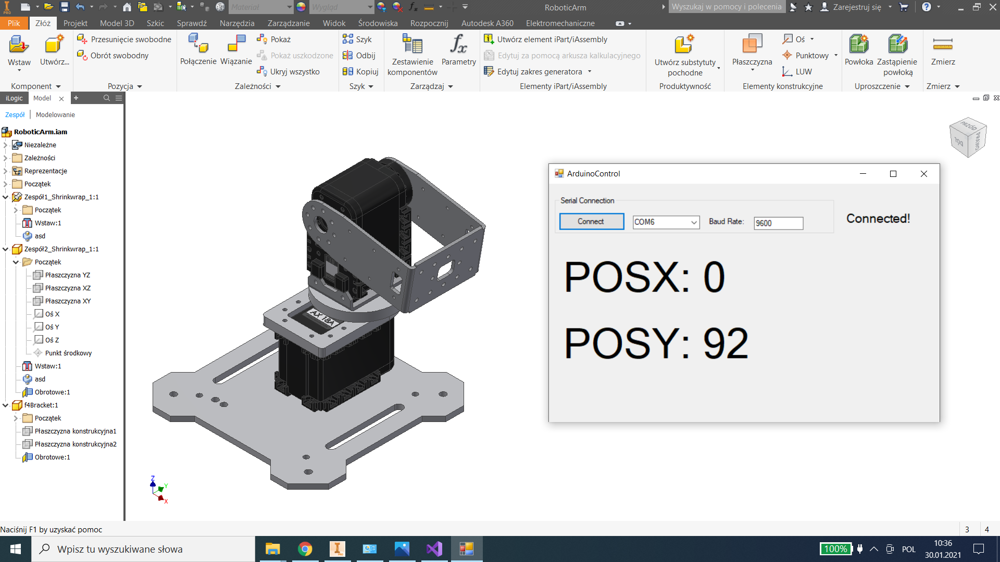

# ControlArduinoByInventorModel

Video available here https://youtu.be/1_sJNIWmCvE

## Table of contents
* [General info](#general-info)
* [Screenshots](#screenshots)
* [Technologies](#technologies)
* [Contact](#contact)

## General info
Control Arduino using the Autodesk Inventor model.

Connect thearduino according to the diagram, then connect the arduino to the USB port. Start Autodesk Iventor and open the "RoboticArm.iam" model. Then run the application and click connect. Now move the model around and watch your arduino.

## Screenshots

## Schematics
[Servo1 -> pin9 -> 5V -> GND]
[Servo2 -> pin10 -> 5v -> GND]

## Technologies
- C# - Windows Forms 
- Visual studio IDE 2019
- Autodesk Inventor Professional 2018
- Arduino UNO
- 2x Servo

## Contact
Created by lukasz.neumann90@gmail.com - feel free to contact me!
